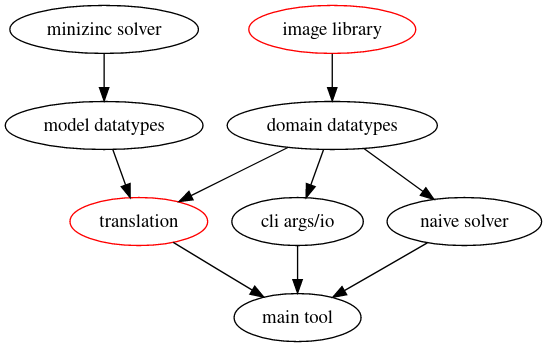
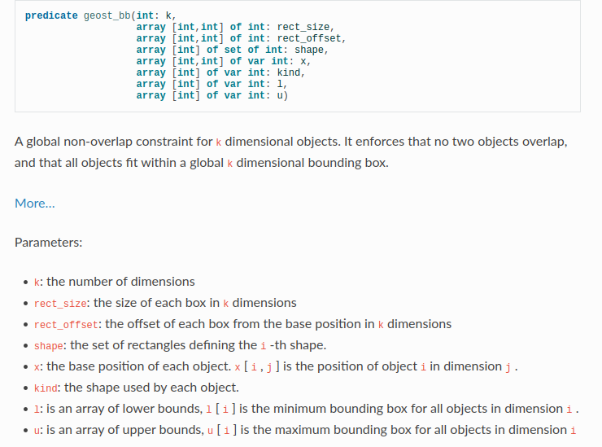
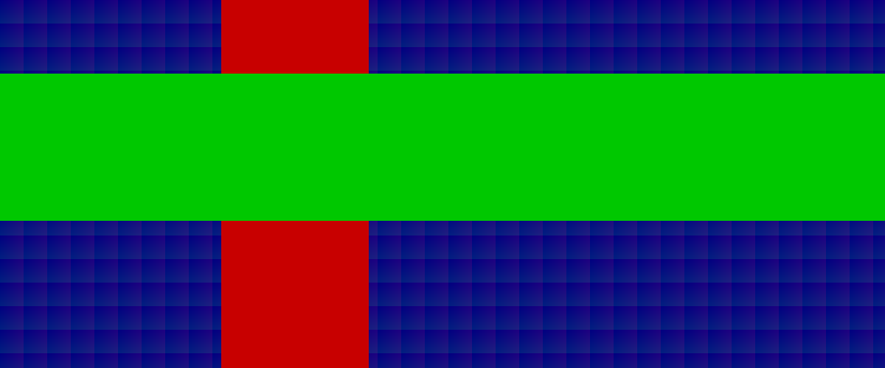
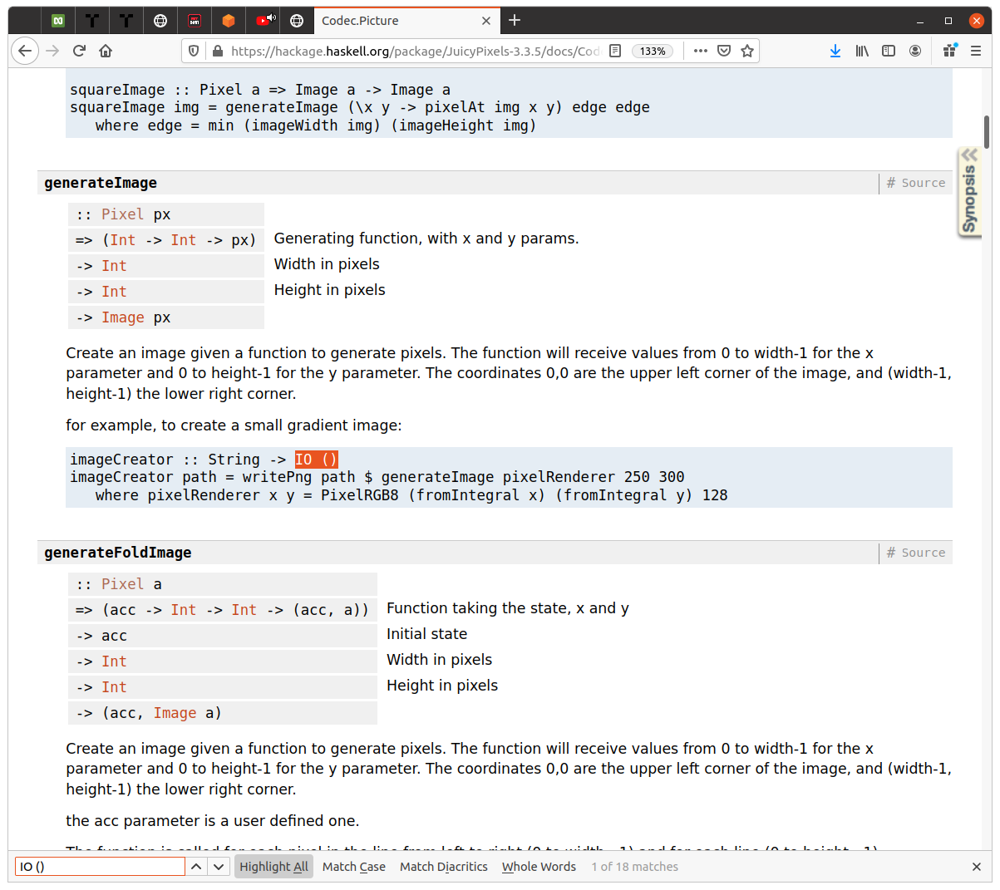
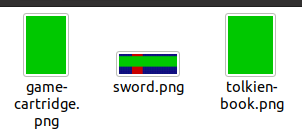
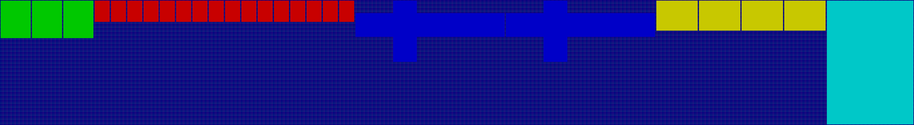
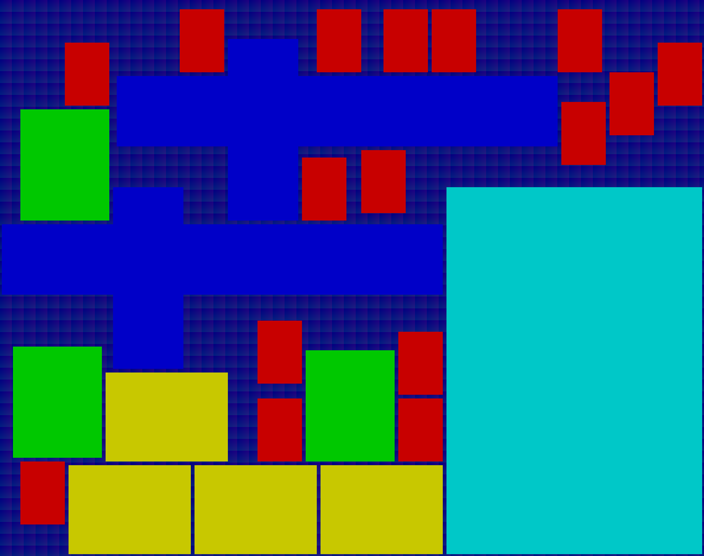
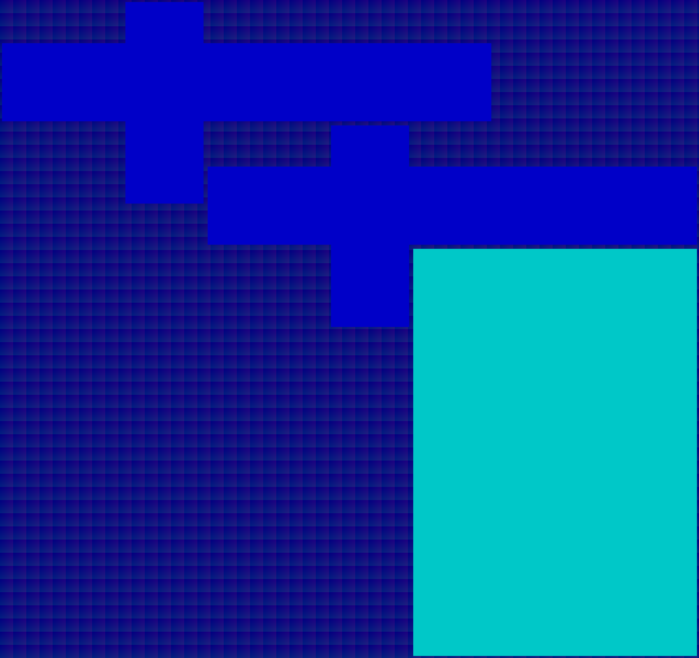
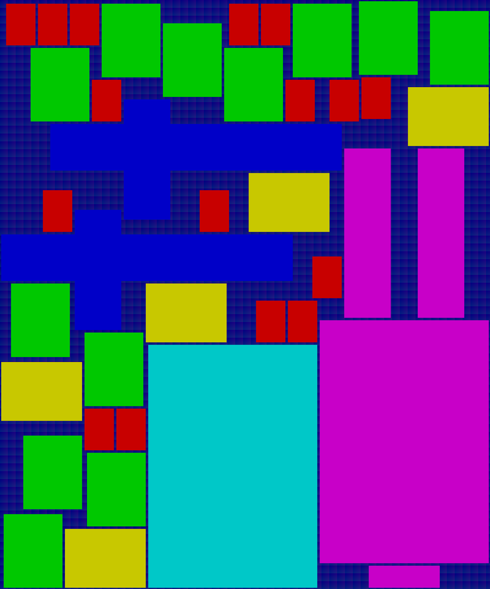

# Santa Wrap

This article is part of [Advent of Haskell](https://adventofhaskell.com/) 2020.
Make sure to check the other articles too!

## Our Christmas project

Year 2020 is terrible. Santa's Workshop had to take stay-at-home restrictions.
However, Elves want to do the utmost to keep Christmas' spirit alive. This
year, Elves will work from home rather than work in the streamlined workshop.
They will get back to a more traditional way of preparing presents, like
Elderly Elves who live more than 500 years, remember.  In short, every Elf
works in their own garage. They receive the Christmas wishlists of neighboring
families: crafting toys, sewing clothes, or cooking delicious cookies.

One particularly annoying task for work-from-home Elves, however, is to wrap
presents. They had avoided this task in the recent years thanks to automation.
Elves all have different pieces of wrapping-paper at home, in particular
wrapping-paper rolls vary in ratio and vary in size from one Elf to another
one. Elves want some software to help them cut wrapping-paper for the
presents they prepare. Some Elves have tools to cut paper (think of a
cookie-cutter, but for large sheets of paper), whereas others only have
cissors. Wrapping may become scarce if used inefficiently, and anyway ordering
takes time. Thus, they would like to have a rough idea of how to efficiently
cut the paper rolls given their own specific constraints. It does not have to
be perfect, but it cannot be completely naive either. Thus, Elves need some
creative idea to save Christmas' spirit. For the better or for the worst
Elves resorted to use software.

Fortunately, an Elf has learnt Haskell, a language especially good for building
small command line tools and with libraries to generate images. He also
has learnt MiniZinc, a language especially good for solving this family of
problems. Put together, these languages can help building a small tool that
Elves can run at home with their own input. This computer-savvy Elf suggests
the following tradeoff:
- Elves will input the quantity and shape of the wrapping for the presents (or
  the shape of their cookie-cutter tools that fit for the present)
- the shape of the wrapping is blocky, that is, made of various rectangle
  blocks, rather than arbitrarily shaped (it simplifies cutting and folding
  paper with rulers and guides anyway)
- Elves will also input the size of their own paper sheets
- the output is a footprint image of how to cut the paper to fit all present
  (when possible)
Some Elves expected more specialized tools, some cared especially about saving
wrapping paper. However, time is running out, our software Elf-ineer only has a
day to build this software or it will be too late to save Christmas.

I am not sure I should reveal this, but, I work in Santa Incorporated oh oh oh.
Do not tell your kids! in exchange I'll explain you how I built `santa-wrap` in
a rush to help the Elf. Thus, the main goal for this article is to relate how
to iterate quickly on a practical one short day project. Secondary goals are to
pike your interest about MiniZinc and introduce you a library named
`minizinc-process`.

## Approach

The type of problem for cutting wrapping paper is known as a Packing problem.
These problems are generally difficult to solve efficiently. However, for small
sizes or particular form of constraints, some solutions could be efficiently
found (or the litterature may have some heuristics that work well empirically).
Generally, the difficulty comes from integrality of constraints, that is you
either can wrap a present or not wrap the present, you cannot wrap a fraction
of a present. Such problems come up a lot in industrial settings where some
resource is scarce. In this particular case, we cheated a bit as we came with
an idea to write a blog post. However, with a bit of practice you will
recognize packing problems everywhere.

We want to show off how to combine MiniZinc (a mathematical optimization
language and toolchain) with Haskell (which readers of this Advent of Haskell
submission are familiar with). We will show the progression of a tool, with
building a value-adding prototype in a day or two of work for some Elf familiar
with Haskell and Minizinc.

## Motivating our Iterations

The author built this tool in four broad iterations: implement a demo solver
in MiniZinc, generate simple pictures for each wrapping, introduce the concept
of layout, and, bridge the solver. We motivate each iteration before jumping
into lengthier explanations.

*Implemeting a solver in MiniZinc*: I wanted to leverage powerful global
constraints with their own heuristics/optimized solutions that exist in
MiniZinc. Such a model helps us formalize the problem in better terms and
understand what are inputs and what are outputs. In a business settings, such
prototypes allow to raise the important questions. In that case, the whole
problem is solved with a single [global contraint](https://www.minizinc.org/doc-2.3.0/en/lib-globals.html#packing-constraints) named `geost_bb`. Knowing
which constraints help modeling a problem is a type of expertise that takes
time to acquire but that can change drastically the viability of such a tool.

*Generate simple pictures*: our tool needs to generate pictures of the
wrapping, and I find a blog-post with picture more appealing than without.
Visualizations illustrate the problem. I am not familiar with low-level
graphics libraries. I typically use high-level tools for my charts like [ggplot
in R](https://ggplot2.tidyverse.org/) -- they typically get in the way if what
you want is pixel-perfect position of image width/height. For this exercise,
I found [JuicyPixels](https://hackage.haskell.org/package/JuicyPixels) and I
need to validate quickly that JuicyPixels will fit the needs.  This library is
appealing because I could generate PNGs with little dependencies. I had some
experience with [Gloss](https://hackage.haskell.org/package/gloss). However, I
discarded this choice for I only need static images and not animations (and
Gloss has way more dependencies than JuicyPixels).

*Introduce the concept of layout*: pictures become more interesting when we
start to have multiple boxes. Once I know how to print a layout I am done with
the graphical aspects of the problem. Minor improvements can still come later
but it is mind-relaxing to call something done. Further, at this point it is
easy to show some naive layouts.

*Bridge the solver*: this is the boiler-plate part of the work.
`minizinc-process` actually have a TemplateHaskell helper to generate an input
and output representations but this approach is limited: it cannot work with
sets in its current version and does not preclude writing boilerplate to
transform between "business-domain" representations and solver input/output
representations. Plus, the goal of the article is to illustrate the pro/cons.
This part of boiler-plate is the one requiring the most care, hence my usage of
newtypes to differentiate indices.

Graphically, the following dependency graph shows the various steps I had in
mind.   In red are the two chunks of work which I
assessed has being the most uncertain (i.e., requiring the most discovery) or
most meticulous (i.e., spending time building accurate types to reduce the risk
of bugs). 

Let's discuss how this four iterations looked like.

## The four iterations

We now dive in more details into each iteration. Recall that I time-boxed this
project to the equivalent of a short-day-of-work. Readers should be able to
read these independently.

### A solver in MiniZinc

We basically call the _global contstraint_ `geost_bb`. Let's unpack how it
works, starting from a small MiniZinc overview and a mini tutorial on
`geost_bb`.

In [MiniZinc](https://www.minizinc.org/) you separate the structure of a
problem (which we call a model) and its particular instance (determined by
input parameters). Thus a model can run for various input parameters. Further,
the model separate two families of variables: the _par_ variables (parameters
that are given or can be deterministically computed from other parameters) and
_var_ variables (decisions that the solver will make). Constraints are
statement that link variables together. The solver, then works out solutions
(that is assignments of variables) that are consistent with all constraints. It
is typically easy to verify that a given assignment matches all constraints.
For instance, in our Santa-Wrap tool can visually inspect whether or not
cutting guides for different present intersect. Whereas, it is typically hard
to find a given assignment for all possible _par_ inputs (or an optimal one
when a criteria of goodness exists).

In Haskell parlance: `solver :: Model -> Parameters -> Maybe Decisions`, which,
partially-applied for some `Model` would give `solveProblem :: Parameters ->
Maybe Decisions`. To encode this faithfully in Haskell we would need to ensure
that the `Parameters` and `Decisions` types actually depends on the `Model`;
somehow, discussing these type-level programming techniques is out of scope for
this article.

Typically, writing MiniZinc is a bit like SQL queries: you describe what you
want and let the engine fetch it for you. The ability to summon a magic tool to
solve our wishes comes with some limitations: expressivity is limited, and you
need to be careful what you wish for. For instance, when writing MiniZinc you
need to discuss about finite inputs/outputs (e.g, no unbounded recursion).
Further, small changes on the structure of the problem can drastically change
performance (like switching from a index scan to a table scan in SQL query
plan).

The comparison with SQL does not stops at the declarative aspect. Typical
domain models in Haskell have collections such as
[Lists](https://hackage.haskell.org/package/base-4.14.1.0/docs/Data-List.html)
or
[Maps](https://hackage.haskell.org/package/containers-0.6.4.1/docs/Data-Map.html)
or custom [recursively-shaped objects](http://www.cse.chalmers.se/edu/year/2018/course/TDA452/lectures/RecursiveDataTypes.html) etc. Once mapped into tabular form in SQL, special
conversion care is required.  For instance, in Haskell, a type `User { age ::
Int , height :: Int }` would map to a set of integers (one user-id per user)
and two arrays indexed by user-id. So that Haskell domain objects like these.

```haskell
users :: [ User ]
users = [ User 23 172, User 45 180, User 36 165 ]
```

Would translate to the following MiniZinc.

```mzn
set of int: USER = 1..3;
array[USER] of int: age = [ 23, 45, 36 ];
array[USER] of int: height = [ 172, 180, 165 ];
```

Readers familiar with Relational Algebra, DataParallel Haskell, Columnar
Storage, or Entity Component System will find comonalities. We will work this
out for our problem in more detail in the last iteration. So now let's look at
`geost_bb`.

Here is a snapshot of `geost_bb`
[documentation](https://www.minizinc.org/doc-2.5.0/en/lib-globals.html)
. Which sorts of packs blocky-structure on a
multi-dimensional space. This constraint does not try to shrink gaps between
objects, it "merely" (I don't want to downplay how great this is) force
assignments of variables such that no overlap exists between the packed
objects.

We annotate the parameters below to explain why using this function make sense
in Santa-Wrap.  Besides the opaque name, it does exactly what we want to help
the Elves and even a bit more.

- *k*: here we live in two dimensions, that an easy parameter, we'll hardcode it
- *rect_size*: size of each rectangles along each dimension
- *rect_offset*: offset of rectangles long each dimension
- *shape*: wrapping shapes are built from a set of a rectangles, for instance presents
  we can wrap in a simple rectangle would have a single rectangle. More
  elaborated wrapping shapes may require two or more adjacent rectangles.
  For instance the sword here is built with two overlapping rectangles:
   a rectangle is horizontal (largest _rect_size_ is the 1st dimension) and another rectangle is vertical (largest _rect_size_ is the 2nd dimension) and both rectangles are translated along an axis (i.e., one non-zero _rect_offset_). Multiple shapes could re-use the same rectangles if
  they happen to match (hence, saving a bit on the complexity -- but we won't go into this   level of sophistication).
- *l* and *u*: upper and lower bounds for each wrapping, in our case all
  objects can equally be positioned on the wrapping, hence the lower bound is 0
  and the upper bound the size of the roll (minus one if you care about
  millimeters and took no margins of error at all in your measurements)

Then `geost_bb` then contributes constraints to tell the solver to make a
number of decisions:

- `x`: the coordinates of the _wrapping shapes_ (which are themselves built of
  rectangular blocks). For our sword example, we need to add the `rect_offset`
  to the `x` coordinate of the shape to position a rectangle.
- `kind`: the shape used by each object. This mechanism allows `geost_bb`
  to chose any shape for the different objects. External constraints actually prevent
  `geost_bb` does not know how many times it must be using the wrapping-shape
  for a sword, and unconstrained the solver would rather prefer the simpler
  wrapping-shape for a book. This mechanism actually is a feature: the freedom
  to pick among shapes allows to model rotation of shapes, we will not use this
  for now.

In our case, for a first version of the tool we do not need to make that many
decisions: only `x` above is required. Declaring all inputs to give to
`geost_bb` is required, however. We still need to actually declare our `par`
and `var` variables. 

We will have to discuss about a number of entities:
- two dimensions: `int: nDims = 2; set of int: DIM = 1..nDims`
- wrapping shapes:  `int: nShapes; set of int: SHAPE = 1..nShapes`
- rectangular blocks: `int: nBlocks; set of int: BLOCK = 1..nBlocks`
- each object we need to wrap: `int: nObjs; set of int: OBJ = 1..nObjs`
- the roll: it is implicit that we cut one roll, so we do not need to declare anything

Then, some characteristics of entities:
- the size of the roll: `int: x_max; int: y_max`
- the size of individual rectangular blocks and their offsets in each dimension: `array[BLOCK,DIM] of int: rect_sizes; array[BLOCK,DIM] of int: rect_offs`
- the coordinates of where to position cuts for our solution: `array[OBJ,DIM] of var int: coordinates`

Finally there is relational information linking various entities.
- to each object we associate a given shape (present1 is a Guitar, present2 is a book etc.): `array[OBJ] of SHAPE: object_shapes;`
- each shape is the collage of a set of rectangle, we could use various
  external representation to model the set of rectangles (e.g., an
  `array[SHAPE,RECTANGLE] of bool` is isomorphic to an `array[SHAPE] of set of
  RECTANGLE`) but we will stick to the `set` representation that `geost_bb`
  requires (using  another input would require extra constraints to link input
  and `geost_bb` representations)

All in all, the model is in `models/santa-wrap.mzn` and an example input for it is `models/santa-wrap001.dzn`. You can run it with `minizinc models/santa-wrap.mzn models/santa-wrap001.dzn`. And the output I got was:

```
coordinates = array2d(1..10, 1..2, [8, 0, 0, 6, 7, 0, 0, 5, 6, 0, 0, 4, 4, 0, 0, 2, 2, 0, 0, 0]);
```

Which you can read as "first object" is a (8,0), the "second object" is at
(0,6) etc. Elves could work with such an output, however a visual display is
better. Plus they want to prepare their cutting boards, build guides, or simply
pass an eye-check that things are in the right place.

### Generate simple pictures

I have had little interest in graphics in the past. Thus I vaguely know some
Haskell libraries exist like
[diagrams](https://hackage.haskell.org/package/diagrams), `gloss`,
`JuicyPixels`, or [reanimate](https://hackage.haskell.org/package/reanimate).
For this project, I had to dive a bit more and actually pick some library. My
choice settled on `JuicyPixel` for two main reasons: on the first hand, this
library has only a small amount of dependencies (especially system dependencies
-- `gloss` requires some OpenGL). On the other hand, the documentation was
welcoming: I looked for `IO ()` because I looked for some "main" or "print"
equivalent. The first hit on the top module is `generateImage`.  No kidding, here
is the screenshot to prove it: first hit .

The type information tells me the library actually scans every pixel one by
one. It is very likely super inefficient. That said, the cost of optimizing the
packing is the major bottleneck in this problem. Elves can wait a minute to
save hours. A warming case that does not corroborate the claim that Haskell
libraries are poorly documente. My first action was to verify that the example
actually works.

```shell
cabal repl
> import Code.Picture
> let path = "images/toto.png"
> let pixelRenderer x y = PixelRGB8 (fromIntegral x) (fromIntegral y)
> writePng path $ generateImage pixelRenderer 250 300
```

And voila!  thank you so much `JuicyPixels`. It's not
"too good to be true": the example works.

Having secured that I can generate PNG, what is left? we need to define some
Haskell data types to map loosely with what I've learnt is required in the
MiniZinc optimization. However we'll be using Haskell records rather than
columnar values. The idea here is to use these data types as main Haskell types
for parsing a format that Elves are likely to know such as JSON. Further we
want to allow Elves to pass extra information like quantities of each present
they will wrap, colors and names for pictures before crafting the guides etc.

Some excerpt:

```haskell
data Wrapping = Wrapping {
    name       :: Name
  , colorNum   :: Int
  , quantity   :: Quantity
  , rectangles :: [ Rectangle ]
  } deriving (Show, Generic)
instance FromJSON Wrapping

data Rectangle = Rectangle {
    rectX :: Length
  , rectY :: Length
  , offX  :: X
  , offY  :: Y
  } deriving (Show, Generic)
instance FromJSON Rectangle
```

Wrappings are built of Rectangles. Each Rectangle as length/width (lengths in
both dimensions `rectX`, `rectY`) as well as some offset in both dimension. In
addition, each Wrapping has a name, a quantity and some color to visualize more
easily a layout. But before speaking about Layouts, what we can do is to
generate pictures for each Wrapping. This way, Elves can calibrate the units
and verify individual length.

I need to adapt the `JuicyPixels` example I copy pasted to build a function
`printWrapping :: Wrapping -> IO()`. In short, it has a `Wrapping` and its
associated `Rectangles` in scope and we need to implement `pixelRenderer`.

So I'll build utility functions `findRectangle x y` which finds a rectangle
with the right sizes and offset to contain the pixel `(x,y)`.

A single pixel and rectangle test is

```
rectangleContainsPixel x y rect =
  let x0 = scale $ offX rect
      x1 = scale $ offX rect + rectX rect
      y0 = scale $ offY rect
      y1 = scale $ offY rect + rectY rect
  in  x0 <= x && x < x1 && y0 <= y && y < y1
```

Which checks for intervals in both X and Y. The `scale` function just
multiplies tenfold every magnitude (i.e., a dimension of 1 Length is shown with
10 pixel). With that utility function we can now test every rectangles: if some
is found, we color the Pixel with some value, otherwise we use default
background value.

```haskell
pixelRenderer x y =
  case findRectangle x y of
    Nothing -> PixelRGB8 (fromIntegral x `mod` 32) (fromIntegral y `mod` 32) 128
    Just idx -> pixelColor idx

findRectangle x y = List.findIndex (rectangleContainsPixel x y) (rectangles wrapping)
```

I use `List.findIndex` so that on a hit i can also attribute some color (see
`pixelColor :: Int -> PixelRGB8` which defines a palette) and paint the
rectangle in a different color.

Another utility function is needed to give `JuicyPixel` the size of the picture
to create.  This size corresponds to the farthest point in the set of off-set
rectangles `maxX = maximum (0 : [ rectX r + offX r | r <- rectangles wrapping
])`, I named this value the `extentX` of a `Wrapping` in later commits.  I use
comprehension list notation. I add a 0 so that `maximum` does not crash on an
empty list.

Our `main` function basically parses `stdin` into some `[Wrapping]` and
`traverse` this list with our PNG generator.

```haskell
mainParts = do
  wrappings <- eitherDecode' @[Wrapping] <$> ByteString.getContents
  case wrappings of
    Left err -> print err
    Right xs -> traverse_ printWrapping xs
  putStrLn "done!"
```

The parsing leverages the automatically-generated `instance FromJSON` from
`aeson` (extension `DeriveGeneric`).  Note that we use `TypeApplications` for
the syntax `@[Wrapping]` which explicitates what we are decoding from the
content in `stdin`, which also helps GHC provide less general error message
when I change and break things.

This way, our main binary can generate individual images.

```console
$ santa-wrap parts < input/wrapping001.json 
$ done!
```

The parts are individual `.png` files as this listing shows:
.  Elves can use these parts to prepare some guides to
later cut wrapping paper rapidly.

Now let's finally introduce the concept of layout.

### Introduce the notion of layout

The layout is a collection of positioned wrappings. There's an obvious Functor
instance for Positioned. I could refactor Rectangle into a Positioned Rect.
This way, a Layout is a `[ Positioned [ Positioned Rect ] ]` and it is probably
collapsable into a single list by translating the inner Positioned objects.
Something like `flatten :: [ Positioned [ Positioned a ] ] -> [ Positioned a ]`
I feel tempted to actually dig in this direction. However, I'm far from done
and the clock ticks. In short, I will save this for later and perform a good
amount of copy-pasting.

The Haskell code is simply:

```haskell
data Positioned a = Positioned {
    posX :: X 
  , posY :: Y 
  , item :: a 
  } deriving (Show, Functor)
    
data Layout = Layout {
    positionedWrappings :: [ Positioned Wrapping ]
  } deriving (Show) 
```

And now my `printLayout` function has a very similar `pixelRenderer`.
Two distinctions though:
- to color a pixel you need to determines if a `Wrapping` has a `Rectangle`
  and the `Rectangles` are translated by `posX` and `posY`.
- we want to add a few pixels of `margin` so that a series of adjacent squares
  do not appear like a long rectangle, this small margin will ease verifying
  layouts at a glance.

Hence, our `rectangleContainsPixel` test takes all these things into account:

```haskell
rectangleContainsPixel :: X -> Y -> Int -> Int -> Rectangle -> Bool
rectangleContainsPixel posx posy x y rect =
        let x0 = scale $ posx + offX rect
            x1 = scale $ posx + offX rect + rectX rect
            y0 = scale $ posy + offY rect
            y1 = scale $ posy + offY rect + rectY rect
        in  (x0 + margin) <= x && x < (x1 - margin) && (y0 + margin) <= y && y < (y1 - margin)
```

How do you verify that the margin is pretty enough? Simply generate a naive
Layout function. We just lay out shapes left-to-right. 

```haskell
linearLayout :: [ Wrapping ] -> Layout
linearLayout wrappings = Layout $ List.zipWith (\w (x,y) -> Positioned x y w) wrappings xys
  where
    xys :: [(X,Y)]
    xys = List.scanl placeToTheLeft (0,0) wrappings 

    placeToTheLeft :: (X, Y) -> Wrapping -> (X, Y)
    placeToTheLeft (x,y) w = (x + extentX w, 0)
```

The interesting aspect is the use of `List.scanl` to perform a fold an
accumulate intermediary values.  The accumulator is the position for the next
`Wrapping` (hence, we start at `(0,0)` and then we move right by an amount
large enough to ensure there will be no overlap: what we named the _extent_ of
the wrapping shape.

This function does not even take care of the bounds of the roll.  This function
is merely useful to have some comparison point and to exercise the
`printLayout` function.

Running the following command will give the image below.

```console
$ santa-wrap linear-layout ./layout.png < input/wrapping003.json 
done!
```


Now we see the margins, the coloring. We also have a MiniZinc model for
non-naive layouts. Let's bring the two things together.

### Actually bridge the Haskell and MiniZinc code

Showcasing my `minizinc-process` library is, a main motivator (second to saving
Christmas' spirit, though).

Remember that, we want to approach ergonomics for the solver so that in
Haskell-land it feels like we have a function `solver :: Model -> Parameters ->
Maybe Decisions`.  Here enters `minizinc-process`, an helper library that
actually uses MiniZinc support for JSON input/outputs.  This is feasible with
`runLastMinizincJSON`, which has type:

```haskell
runLastMinizincJSON ::
  (ToJSON input, FromJSON answer) =>
  MiniZinc input answer ->
  input ->
  IO (Maybe answer)
runLastMinizincJSON = ...
```

The typeclass constraints on `input` and `output` allow to serialize back and
forth using JSON.  The `Minizinc input answer` actually contains the model
(e.g., a filepath to the `models/santa-wrap.mzn` file) and parameters for
driving MiniZinc (i.e., which solver to use, whether there is a timeout or to
search forever, but also, how to create intermediary `.json` input files that
play the role of the `models/santa-wrap001.dzn` for each different possible
input).  For this project, we use the `simpleMiniZinc` constructor to get a
`Minizinc`that also adds some `Hashable` constraint on the input type so that
we can generate filenames.  Fortunately, `Hashable` is generically-derivable as
well so little boilerplate is incured.

The `runLastMinizincJSON` functions runs for up to the timeout provided in the
MiniZinc option and return the latest decisions (if there is any).  A more
general function `runMinizincJSON` exists. This function takes a state-machine
named `ResultHandler` to handle individual results. Indeed, we can ask MiniZinc
to return multiple solutions, prove that there are no more solutions, and
handling this variety of cases asks for more complicated types.

The underlying type are:

```
data SearchState a
  = Exhausted a
  | Incomplete a
  | Unsatisfiable
  | InternalError String

data ResultHandler obj b
  = ResultHandler
  { handleNext :: b -> SearchState obj -> IO (b, Maybe (ResultHandler obj b))
  }
```

The result handler is parametrized by `obj` which are the decisions that the
solver makes, and the handler is also parametrized by `b` -- an accumulator
state like in a fold. A handler is called each time the search changes
SearchState. The handler is free to do what it wants but must return an updated
state and an updated handler (or an absence of handler to tell the library that
we can stop the search).  Later versions of the library will likely generalize
IO in the handler to some parametric class.

There is not much more to `minizinc-process`. Let's use it in practice.

We need to translate two worldviews for the same information, back and forth.
MiniZinc expects data in array shapes and other parameters giving the length of
these arrays whereas our Haskell data is meant to help interactions with users.
Hence, the Haskell datatypes closely follow Elf-semantics. Typically,
translation code between two worldviews benefits from careful newtypes to
distinguish array indices. Indeed, every entity becomes identified by an index
and it is all too common to make an error.  Multi-dimensional arrays have some
support for types in MiniZinc but the data serialized in JSON do not.

The risk we want to reduce is to mix-up array indices and mix-up the
terminology. This is where newtypes shine in Haskell. Two extensions,
`DerivingStrategies` and `GeneralizedNewtypeDeriving` come handy to
save on boilerplate. 

```haskell
newtype ShapeIdx = ShapeIdx Int
  deriving stock Show
  deriving stock Eq
  deriving newtype Hashable
  deriving newtype ToJSON
newtype BlockIdx = BlockIdx Int
  deriving stock Show
  deriving newtype Hashable
  deriving newtype ToJSON
```

We can now write an Haskell data type for the input. This data type has fields
mapping closely the names of `par` variables in MiniZinc (which you find
declared in the `./models/santa-wrap001.dzn`). Arrays map to lists, two
dimensional arrays become nested lists. Sets required me to define an
indirection named `MinizincSet` (will be merged upstream) to match MiniZinc
expectations for its JSON inputs. Thus, my Input and Output types become.

```haskell
data Input = Input {
    nBlocks :: Int
  , rect_sizes :: [[Int]]
  , rect_offs :: [[Int]]
  , nShapes :: Int
  , shapes :: [ MinizincSet BlockIdx ]
  , nObjs :: Int
  , object_shapes :: [ ShapeIdx ]
  , x_max :: Int
  , y_max :: Int
  } deriving (Show, Generic)
instance Hashable Input
instance ToJSON Input

data Output = Output {
    coordinates :: [ (X, Y) ]
  }
  deriving (Show, Generic)
instance FromJSON Output
```

The rest of the work now requires to build a `convertInput` function that takes
Haskell domain values, map that into an Input. This mapping will require to
give integral IDs to entities. For instance, each individual `Wrapping` in the
input requires as many `OBJECT` as the `quantity` requires.
I typically use list-comprehensions and zipping with `[1..]` to achieve this indexing.

For instance, each `Wrapping` has one `SHAPE` in our problem.
Thus, we provide an indexed list of shapes and its "originating" `Wrapping` as follows.

```haskell
indexedWrappings :: [(ShapeIdx, Wrapping)]
indexedWrappings = zip (fmap ShapeIdx [1..]) wrappings
```

The `BLOCK` and their `rect_sizes, rect_offs` are a bit more complicated.  To
build everything we want, we need a "table" with, for each SHAPE, what BLOCK it
is made of, and the "originating" `Rectangle` to get carry the sizes and
offsets.

```haskell
indexedRects :: [(ShapeIdx, BlockIdx, Rectangle)]
indexedRects = zipWith (\blockIdx (shapeIdx, r) ->  (shapeIdx, blockIdx, r))
  (fmap BlockIdx [ 1.. ])
  [ (shapeIdx, r) | (shapeIdx,w) <- indexedWrappings, r <- rectangles w ]
```

We can then compute the number of `BLOCK`, which is `nBlocks = length
indexedRects`.  An optimization could have been to share equal blocks when
shared across `SHAPEs` (i.e., when a same `Rectangle` appears in two
`Wrappings`). Let's not suffer from early optimization.

We can now build the `rect_sizes` and `rect_offs` of each `BLOCK` by directly
looking at the values associated in the "originating" `Rectangle`.

```haskell
rect_sizes = [ [rectX r, rectY r]  | (_,_,r) <- indexedRects ]
rect_offs = [ [offX r, offY r] | (_,_,r) <- indexedRects ]
```

and the relational information "which SHAPE contains which BLOCK" is a reading
of the 'join' of the `indexedRects` and the `indexedWrappings` tables. Again,
we use comprehension-lists to the cardinal product of the two tables (and
collecting that in `MinzincSet`).

```haskell
shapes = [ MinizincSet
           [ blockIdx | (shapeIdx2,blockIdx,_) <- indexedRects
                      , shapeIdx1 == shapeIdx2
           ]
         | (shapeIdx1,_) <- indexedWrappings
         ]
```

Performance could become a concern for large amount of `Wrapping` and large
amount of `Rectangle`. However, again, we are not chasing seconds in
serialization/translation code as we are ready to spend minutes of solver-time
to saves hours to our Elves. If data proves this piece of code is the
bottleneck in practice, we can then try to optimize further this type of code.
Since the code is pure, it is really amenable to property testing under
QuickCheck or HedgeHog: for any data, both the (slow)-reference and
(putatively-optimized)-candidate functions are returning equal outputs.

Finally, our MiniZinc model wants `OBJECT`, one per present rather than one per
Wrapping objects (the Haskell data model holds a quantity). I mistakenly did
two things at a time: expanding quantities  and associating a Shape to each
Wrapping.  `flattenedWrappings` in the heat to release something early for our
Elves.

```haskell
flattenedWrappings :: [(ShapeIdx, Wrapping)]
flattenedWrappings = mconcat [ replicate (quantity w) (shapeIdx, w) | (shapeIdx, w) <- indexedWrappings ]
```

This code means that if we have `Wrapping { name = abc , quantity = 2 }` and `Wrapping {name = def, quantity = 5}` then we have to lay out seven `OBJECT`, two of `SHAPE` associated to `abc` and five of `SHAPE` associated to `def`. The corresponding boilerplate is:

```haskell
nObjs = length flattenedWrappings
object_shapes = fmap fst flattenedWrappings
```

I think this covers most of the boiler-plate. Extra function arguments are the size of the roll

```haskell
x_max = sizeX
y_max = sizeY
```

It is tempting to just write the "forward translation code" and call it a day.
In reality, if you were a consumer of such a library, you would like to
minimize this horrendous boiler plate, and you still need some "reverse
translation code".  Be kind to your users. You have done a lot of work to
create "indexed" arrays once, you'd rather not duplicate this code. Even if you
do not duplicate the code, having colocated everything within the constraints
of a pure function will guarantee you that no non-determinism creeps in.
Hence, you should make a "reverse translation function" at the same time as you
translate forward. Bonus: you can guarantee that calls of unsafe functions
(like array indexing) actually are safe because you are writing the providing
and consuming dynamically-shaped data at the same place.

Indeed, because we have access to `flattenedWrappings` our "reverse translation
code" is a single line.

```haskell
layoutOutput :: Output -> Layout
layoutOutput (Output coords) = Layout
    $ zipWith (\w (x,y) -> Positioned x y w) [w | (_,w) <- flattenedWrappings] coords
```

Writing all this boilerplate takes time (hence why I circled it red at the
beginning in my dependency graph for the tasks in this project). Such
translation code would be hard to generate in the general case. Hence I do not
have very good solutions but to be careful and use `newtype` for each index.
The good news, however, is that it is pretty easy to debug: generate simple
cases with one then two `Wrapping`, observe the generated `.json` file.

At last we can be gratified. A simple `main` that ressembles the one for
`linearLayout` allows us to generate layouts for given roll sizes.

```console
$ santa-wrap minizinc-layout ./layout-190x150.png 190 150 < input/wrapping003.json
done!
$ santa-wrap minizinc-layout ./layout-170x160.png 170 160 < input/wrapping003.json
done!
$ santa-wrap minizinc-layout ./layout-170x159.png 170 159 < input/wrapping003.json
no layout found!
```

The first command greets us with the following picture
.  We can try shrinking the Y-coordinates,
160 is still good, but 159 is too hard (note: it is actually infeasible but the
`runLastMinizincJSON` function makes no distinctions between timeout and
unfeasible).  Visual inspection of the Y=160 case seems to show
that the two cross-shaped and the big rectangle are the main reasons to limit
the roll size .

Convince yourself with this picture (done by modifying the input JSON to delete everything but the _shoes_ and the _sword_ entries:
.

OK, with this `santa-wrap` tool, Elves are in good shape to save Christmas'
spirit. Thank you MiniZinc and Haskell!

For the fun try packing that yourselves (input is `input/wrapping005.json`)


## Discussion

Given more times, a number of possible improvements could happen. For a work
project more discussions with the Elves would help adding more constraints to
the Model. We next discuss some possible "improvements".

### Possible improvements

Elves have deadlines too, although they would love to keep improving their
tools, they have other important (albeit slightly more mundane) tasks at their
day jobs. Besides the discussion about Positioned being an interesting
abstraction, I want to discuss improvements to the solver/problem itself and
illustrate how business ideas are generated/pruned with such discussions.

A user may suggest improvements to the tool, but not all improvements are
equally easy to introduce. Here are a few options:
- easy: reduce some cost (material spent) ; you would need to change the
  satisfyability into some optimiziation trying to minimize the area bounded by
  maximum X-Y coordinates
- medium: pick an orientation (left-right vs. up-down) ; you would need to
  change Input, Output, and the model to tell which shapes an object can take,
  but `geost` already takes care of that
- hard: attribute multiple rolls at once ; you would need to change Input,
  Output, and the model to pass a number rolls (maybe to each one their size)
  and modify the MiniZinc model to decide a roll for each object; you'd generate
  two pictures per problem
- crazy-hard: time taken to cut with cissors ; you would need to significantly
  alter the model to express the notion of "gaps" or "external".

In a typical setup I would propose to deliver the easy and medium improvements
before calling the tool done. I would suggest to propose the hard improvement
as more data is generated to understand if Elves actually would benefit from
such changes. I would root against the crazy hard, and even propose to equip
Elves with cutting-tools and drop cissors would probably use total surface as a
good enough proxy, simulators can help assess how bad.

Elves would love to hear about your improvement suggestions or merge requests!
Feel free to contact me or to open some Issues to discuss them together.

### Epilogue

Alright, this blog post was longer than I expected. I wanted to show how
Haskell can be used to solve a very practical problem and also put onto words
some "tactical thinking" to avoid losing time on the less-important aspects
(the one I have not circled red in my dependency diagram). My main challenge
was to time-box my work to one day of code: on top of my Elvish missions I have
a day job and all-in-all this is a good constraint to simulate a real-world
situation. The information I had before starting: I knew `JuicyPixels` existed
but had never used it before, I sort of framed the Santa-Wrap problem to
illustrate a non-trivial MiniZinc global (`geost_bb` arguably is pretty
advanced). I built the `minizinc-process` library and wanted a pretext to
show-case it. I could have taken a shortcut as `minizinc-process` offers some
TemplateHaskell to generate `Input` and `Output` datatypes (with no newtypes
and no support for sets, the pedagogy would have suffered).

An advantage of the Haskell + MiniZinc combination is to be able to use each
tool for what they are best at. Haskell allows me to write solid backend
services and command line tools whereas MiniZinc allows me to model using
MiniZinc IDE (e.g., with a nice syntax for multi-dimensional arrays). In this
setup the key difficulty is the boilerplate code required to translate inputs
and outputs.

I hope this article piqued your interest. Feel free to contact me if you are
curious whether these types of techniques are a good fit for you.  I gave a
presentation of MiniZinc at an online event this year, and you will find much
more on the website and on the Coursera lessons (time consuming).

Thanks to Advent of Haskell organizers and all the other articles authors. 

I wish you all the best for the end of 2020 and cheers to a better 2021!

Oh oh oh!

--
[Lucas DiCioccio](https://github.com/lucasdicioccio)
